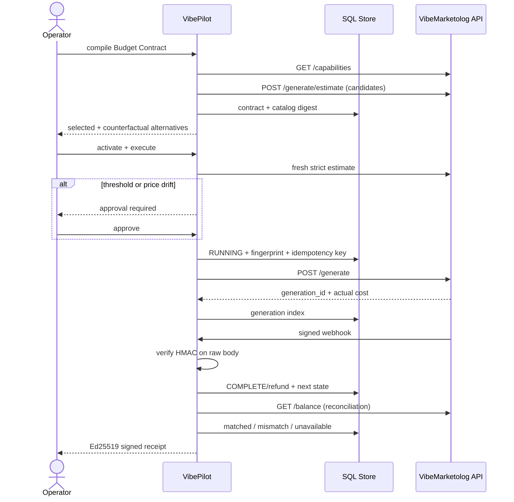

# Архитектура VibePilot 0.3

## Модули

- `planner.py` — выбор только из self-describing каталога, payloads и fallbacks.
- `contracts.py` — counterfactual scenarios, Budget Contract и digests.
- `vibe_client.py` — единственная граница Agent API, retries и ошибки.
- `store.py` — SQL persistence, revisions и generation index.
- `receipts.py` — Ed25519 signing и независимая проверка.
- `main.py` — HTTP API и state-machine orchestration.

## Инварианты

1. Demo не меняет `actual_spend_rub`.
2. Live невозможен без VIBE-токена и operator key.
3. Ни один async-шаг не получает `complete` без status/webhook от платформы.
4. Перед каждым generate выполняется estimate финального payload.
5. До generate сохраняются fingerprint и idempotency key.
6. Net spend равен `sum(cost) - sum(refund)`.
7. Reserve не считается расходом.
8. Старую ревизию workflow нельзя записать поверх новой.
9. Webhook без правильной HMAC-подписи не изменяет состояние.
10. Любое изменение signed receipt ломает Ed25519 verification.
11. Сверка баланса не подменяет generation costs: mismatch сохраняет обе цифры.
12. Demo-цена всегда помечена `catalog_indicative`, live — `vibe_estimate`.
13. Approval действует только для одобренных payload fingerprint и цены.
